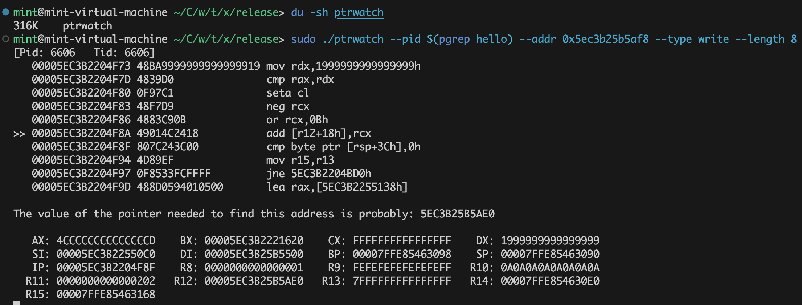

# PointerWatcher-X

> Find out what (accesses,writes) this address.



In contrast to [PointerSearcher-X](https://github.com/kekeimiku/PointerSearcher-X), [PointerWatcher-X](https://github.com/kekeimiku/PointerWatcher-X) provides a manual method for finding pointer chains.

ptrwatch --help
```
Usage: ptrwatch -p <pid> --addr <addr> --type <type> --length <length>

Find out what (accesses,writes) this address.

Options:
  -p, --pid         pid
  --addr            addr: hex format
  --type            type: (access,write)
  --length          length: (1,2,4,8)
  --help            display usage information
```